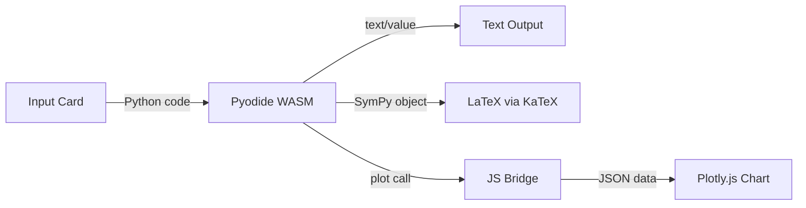

# SciREPL — Mobile Scientific Python REPL

A **free, open-source** mobile-first Python REPL powered by Pyodide + Capacitor.

 

## What is SciREPL?

A browser-based Python REPL designed for scientific computing on mobile devices:

- ✅ **Offline Python** via Pyodide (WASM)
- ✅ **Rich output**: LaTeX math, interactive Plotly charts, tables
- ✅ **NumPy + SymPy** preloaded
- ✅ **Hybrid plotting**: Python `plot()` → Plotly.js
- ✅ **Variable persistence** across inputs (like Jupyter)
- ✅ **Semicolon suppression** (MATLAB/IPython-style)
- ✅ **Mobile-first UI**: Dark theme, touch-friendly

## Quick Start

### Run Locally

```bash
cd examples/sci-repl
python3 -m http.server 8080 -d www
```

Open http://localhost:8080. Wait 30-60 seconds for Pyodide to load.

### Try It

```python
# Basic math
2 + 2

# NumPy arrays
import numpy as np
np.linspace(0, 10, 5)

# Plotting
x = np.linspace(0, 2*np.pi, 50)
plot(x, np.sin(x))

# SymPy (LaTeX rendering)
from sympy import symbols, diff, sin
x = symbols('x')
diff(sin(x), x)  # Shows cos(x) as fancy math

# Suppress output (creates array but doesn't print)
a = np.arange(1000);
```

## Free vs Premium

This is the **free open-source version**. It includes:

| Feature | Free | Premium |
|---------|------|---------|
| Python + NumPy + SymPy | ✅ | ✅ |
| Interactive plots | ✅ | ✅ |
| LaTeX rendering | ✅ | ✅ |
| Variable persistence | ✅ | ✅ |
| **Edit past cells** | ❌ | ✅ |
| **Import `.ipynb` files** | ❌ | ✅ |
| **Save/load sessions** | ❌ | ✅ |
| **Math Mode** (auto-imports, `^` → `**`) | ❌ | ✅ |
| **Offline Android app** | ❌ | ✅ |

*Premium version coming soon. Star this repo to stay updated!*

## Architecture



- **[index.html](www/index.html)** — App shell with CDN loads
- **[css/style.css](www/css/style.css)** — Dark theme, mobile-first layout
- **[js/app.js](www/js/app.js)** — REPL loop, Pyodide init, card management
- **[js/bridge.js](www/js/bridge.js)** — JS rendering: `renderPlot()`, `renderLatex()`, `renderTable()`
- **[js/prelude.py](www/js/prelude.py)** — Python bridge: `plot()`, `mplot()`, `table()`, pre-imports

## Key Features Explained

### Hybrid Plotting

Unlike Jupyter's matplotlib (which generates static PNGs), SciREPL uses a **Python→JS bridge**:

```python
def plot(x, y, **kwargs):
    # Serialize data to JSON
    js.renderPlot(json.dumps({"x": x, "y": y, ...}))
```

The JS side renders with **Plotly.js**, giving you:
- Pinch-zoom, pan, hover tooltips
- Fast, native rendering (no WASM overhead)
- Touch-friendly on mobile

### LaTeX Rendering

SymPy expressions auto-render as LaTeX:

```python
from sympy import symbols, sqrt, solve
a, b, c, x = symbols('a b c x')
solve(a*x**2 + b*x + c, x)  # Renders quadratic formula as column vector
```

Lists of SymPy objects (like `solve()` results) render as LaTeX column vectors.

### Output Behavior

**Like Jupyter notebooks**, SciREPL shows:
1. **All `print()` statements** execute and display
2. **The last expression's value** is automatically shown
3. **Semicolons suppress** the automatic display

Examples:

```python
# Only shows 15
a = 5
b = 10
a + b
```

```python
# Shows "hello" then "world" then 42
print("hello")
print("world")
42
```

```python
# Shows "created" but NOT the array (semicolon suppresses)
arr = np.arange(1000);
print("created")
```

```python
# Shows both printed output AND the final value
print("Calculating...")
2 + 2  # Shows 4
```

**Long outputs** (>10,000 characters) are automatically truncated with a message showing the total length.

### Semicolon Suppression

Like MATLAB and IPython, end your code with `;` to suppress output:

```python
big_array = np.arange(100000);  # Assigns but doesn't print
len(big_array)                  # Prints 100000
```

Outputs longer than 10,000 characters are automatically truncated.

## Building for Android

```bash
npm install
npx cap add android
npx cap sync
cd android
./gradlew assembleDebug
```

APK output: `android/app/build/outputs/apk/debug/app-debug.apk`

## Roadmap

- [ ] Help tab with examples and keyboard shortcuts
- [ ] PWA manifest (install on mobile without app stores)
- [ ] Session export as JSON
- [ ] Matplotlib backend fallback
- [ ] Premium: Editable history
- [ ] Premium: `.ipynb` import
- [ ] Premium: Math Mode (Sage-like syntax)

## Contributing

This is a **UnifyWeaver project prototype**. PRs welcome!

1. Fork the repo
2. Create a feature branch
3. Make your changes
4. Submit a PR to `main`

## License

MIT License — see [LICENSE](LICENSE)

## Credits

Built with:
- [Pyodide](https://pyodide.org/) — Python in the browser
- [Plotly.js](https://plotly.com/javascript/) — Interactive charts
- [KaTeX](https://katex.org/) — LaTeX rendering
- [Capacitor](https://capacitorjs.com/) — Native mobile builds

---

🌟 **Star this repo if you find it useful!** 🌟

For premium features or commercial use, contact: [your-email@example.com]
