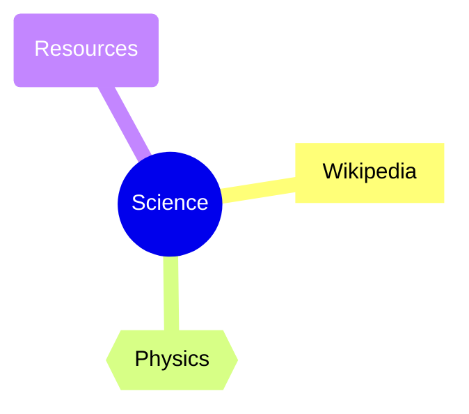

# Pearltrees Processing Example

Educational example demonstrating UnifyWeaver's capabilities for data processing, multi-format output, and code generation.

## Purpose

This example shows how UnifyWeaver can:

1. **Define data sources** - SQLite, JSONL, runtime JSON
2. **Write aggregate queries** - Grouping, counting, filtering
3. **Generate multiple output formats** - Direct output to various mindmap formats
4. **Generate target code** - Same logic → Python, C#, Go, etc.

**Note**: This does NOT replace the existing Python tools in `.local/tools/browser-automation/`. Each target generates its own database access and runtime code.

## Files

| File | Description |
|------|-------------|
| `sources.pl` | Data source definitions with target-specific config |
| `queries.pl` | Aggregate queries and composable filters for tree/pearl data |
| `templates.pl` | Multi-format output (SMMX, FreeMind, OPML, GraphML, VUE, Mermaid) |
| `compile_examples.pl` | Cross-target code generation examples |
| `browser_automation.pl` | Abstract browser automation workflow |
| `hierarchy.pl` | Hierarchical tree transformations |
| `semantic_hierarchy.pl` | Semantic embeddings, clustering, hierarchy |
| `test_queries.pl` | 36 plunit tests for queries and filters |
| `test_templates.pl` | 44 plunit tests for templates (all formats) |
| `test_browser_automation.pl` | 22 plunit tests for browser automation |
| `test_hierarchy.pl` | 105 plunit tests for hierarchy predicates |
| `test_semantic_hierarchy.pl` | 19 plunit tests for semantic predicates |
| `test_codegen.pl` | 25 plunit tests for code generation |
| `test_glue_integration.pl` | 36 plunit tests for cross-target glue integration |
| `compile_vue_examples.pl` | Vue SFC code generation from Prolog |
| `vue/PearltreesHierarchy.vue` | Example Vue hierarchy visualization |
| `vue/MindMapViewport.vue` | Reusable Vue viewport component |

## Source Definitions

Sources define where data comes from, with per-target configuration:

```prolog
:- source(sqlite, pearl_children, [
    table(children),
    columns([parent_tree_id, pearl_type, title, ...]),
    target_config(python, [db_path('...')]),
    target_config(csharp, [async(true)]),
    target_config(go, [driver('go-sqlite3')])
]).
```

Each target generates idiomatic database access:
- **Python**: `sqlite3` module
- **C#**: `Microsoft.Data.Sqlite` with async
- **Go**: `database/sql` with driver

## Aggregate Queries

Queries use `aggregate_all/4` for grouping:

```prolog
tree_with_children(TreeId, Title, Children) :-
    pearl_trees(tree, TreeId, Title, _, _),
    aggregate_all(
        bag(child(Type, ChildTitle, Url, Order)),
        pearl_children(TreeId, Type, ChildTitle, Order, Url, _),
        TreeId,
        Children
    ).
```

Generated code per target:
- **Python**: `itertools.groupby` or dict comprehension
- **C#**: LINQ `GroupBy().Select()`
- **Go**: `map[string][]Child` with append
- **SQL**: `GROUP BY` with `JSON_AGG`

## Query-Based Filtering

Composable filter predicates for selecting trees and children:

### Filter Types

| Filter | Predicate | Description |
|--------|-----------|-------------|
| Domain | `has_domain_links/2` | Trees with links to a domain |
| Type | `has_child_type/2` | Trees containing specific child types |
| Title | `title_contains/2` | Title/content keyword search |
| Count | `trees_with_min_children/2` | Trees with minimum child count |
| Combined | `apply_filters/3` | Multiple filters at once |

### Example: Find Trees with GitHub Links

```prolog
?- has_domain_links(TreeId, 'github.com').
TreeId = '12347'.
```

### Example: Combined Filters

```prolog
%% Find complete trees with pagepearl children
?- apply_filters([complete, type(pagepearl)], TreeId, Info).
Info = tree_info('12345', 'Science Topics', 3).

%% Find trees with GitHub links and at least 2 children
?- apply_filters([domain('github.com'), min_children(2)], TreeId, Info).
Info = tree_info('12347', 'Tech Links', 2).

%% Find incomplete trees (negation)
?- apply_filters([not(min_children(2))], TreeId, Info).
Info = tree_info('12346', 'Empty Tree', 1).
```

### Available Filters

- `domain(Domain)` - Trees with links to domain
- `type(Type)` - Trees with children of type (pagepearl, tree, section, alias)
- `title_match(Pattern)` - Case-insensitive title search
- `min_children(N)` - At least N children
- `max_children(N)` - At most N children
- `incomplete` - Trees with ≤1 children
- `complete` - Trees with >1 children
- `cluster(ClusterId)` - Trees in specific cluster
- `not(Filter)` - Negation of any filter
- `is_root` - Root trees (no parent)
- `is_leaf` - Leaf trees (no children)
- `is_orphan` - Orphan trees (parent doesn't exist)
- `at_depth(N)` - Trees at exact depth N
- `max_depth(N)` - Trees at depth ≤ N
- `min_depth(N)` - Trees at depth ≥ N
- `under(AncestorId)` - Descendants of a tree
- `has_descendant(DescendantId)` - Ancestors of a tree
- `sibling_of(SiblingId)` - Sibling trees

## Output Formats

Direct output to multiple mindmap formats from the same tree data:

| Format | Predicate | Extension | Compatible With |
|--------|-----------|-----------|-----------------|
| SMMX | `generate_mindmap/4` | `.smmx` | SimpleMind |
| FreeMind | `generate_freemind/4` | `.mm` | FreeMind, Freeplane, XMind |
| OPML | `generate_opml/4` | `.opml` | Workflowy, Dynalist, OmniOutliner |
| GraphML | `generate_graphml/4` | `.graphml` | yEd, Gephi, Cytoscape |
| VUE | `generate_vue/4` | `.vue` | Tufts VUE |
| Mermaid | `generate_mermaid/4` | `.md` | GitHub, GitLab, Obsidian |

### Example: Generate Multiple Formats

```prolog
?- Children = [child(pagepearl, 'Link', 'http://example.com', 1)],
   generate_freemind('123', 'My Tree', Children, MM),
   generate_opml('123', 'My Tree', Children, OPML),
   generate_mermaid('123', 'My Tree', Children, Mermaid).
```

### Mermaid Output Example



### Unified Multi-Format Generation

Generate multiple formats at once:

```prolog
?- Children = [child(pagepearl, 'Link', 'http://example.com', 1)],
   generate_all_formats('123', 'My Tree', Children, [freemind, opml, mermaid], Results).
% Results = [format(freemind, '.mm', '...'), format(opml, '.opml', '...'), ...]
```

Available predicates:
- `available_formats/1` - List all supported formats
- `generate_all_formats/5` - Generate multiple formats at once
- `generate_for_format/5` - Generate a single format (in compile_examples.pl)

## Usage

### Generate Python Code

```prolog
?- use_module('src/unifyweaver/examples/pearltrees/queries'),
   compile_predicate_to_python(tree_with_children/3, [mode(generator)], Code),
   format('~s~n', [Code]).
```

### Generate C# Code

```prolog
?- compile_predicate_to_csharp(incomplete_tree/2, [async(true)], Code).
```

### Generate Go Code

```prolog
?- compile_predicate_to_go(tree_child_count/2, [], Code).
```

## Hierarchical Transformations

Navigate, query, and transform Pearltrees hierarchies:

### Navigation Predicates

| Predicate | Description |
|-----------|-------------|
| `tree_parent/2` | Get immediate parent of a tree |
| `tree_ancestors/2` | Get path from root to tree |
| `tree_descendants/2` | Get all descendants recursively |
| `tree_siblings/2` | Get sibling trees |
| `tree_depth/2` | Compute depth from root |
| `tree_path/2` | Get full path as list |
| `tree_title/2` | Get tree title |

### Structural Queries

| Predicate | Description |
|-----------|-------------|
| `root_tree/1` | Identify root nodes |
| `leaf_tree/1` | Identify leaf nodes |
| `orphan_tree/1` | Find disconnected trees |
| `subtree_tree/2` | Check subtree membership |

### Path Operations

| Predicate | Description |
|-----------|-------------|
| `path_depth/2` | Count path elements |
| `truncate_path/3` | Limit path depth |
| `common_ancestor/3` | Find shared ancestor of two trees |
| `hierarchical_title_path/2` | Get title path from root |

### Basic Transformations

| Predicate | Description |
|-----------|-------------|
| `flatten_tree/3` | Collapse depth levels |
| `prune_tree/3` | Remove branches by criteria |
| `trees_at_depth/2` | Select trees at depth |
| `trees_by_parent/2` | Group trees by parent |

### Advanced Transformations

| Predicate | Description |
|-----------|-------------|
| `reroot_tree/3` | Change hierarchy root |
| `merge_trees/3` | Combine multiple tree lists |
| `group_by_ancestor/3` | Cluster by ancestor at depth |

### Embedding Support

| Predicate | Description |
|-----------|-------------|
| `structural_embedding_input/3` | Generate embedding text format |
| `format_id_path/2` | Format slash-separated ID path |
| `format_title_hierarchy/2` | Format indented title hierarchy |

Example embedding format:
```
/root_1/science_2/physics_3
- Root
  - Science
    - Physics
      - Quantum Mechanics
```

### Alias Handling (Cross-Account Traversal)

AliasPearls link trees across accounts. When `follow_aliases(true)` is set, traversal predicates follow these links:

| Predicate | Description |
|-----------|-------------|
| `alias_target/2` | Resolve alias URI to target tree ID |
| `alias_children/2` | Get all alias targets from a tree |
| `tree_aliases/2` | Get detailed alias info (title, order, target) |

Example: Follow aliases when getting descendants:
```prolog
?- tree_descendants('arts_5', Descendants, [follow_aliases(true)]).
% Includes both direct children AND trees linked via aliases
```

Alias handling is essential for:
- **Semantic embeddings**: Hierarchical context spans accounts
- **Curated folders**: Complete hierarchy includes cross-account links
- **User's mental model**: Users organize across accounts via aliases

### Cycle Detection

Cycles can occur when tree relationships form loops (A -> B -> A). All traversal predicates detect cycles to prevent infinite loops:

| Predicate | Description |
|-----------|-------------|
| `has_cycle/1` | True if tree has a cycle in its ancestry |
| `cycle_free_path/2` | Get path stopping at cycle point |

Example:
```prolog
?- has_cycle('suspicious_tree').
true.  % Cycle detected - traversal would loop

?- cycle_free_path('suspicious_tree', Path).
Path = ['tree_a', 'tree_b'].  % Stops before repeating
```

Cycle detection is automatic in:
- `tree_ancestors/2,3`
- `tree_descendants/2,3`
- `tree_path/2,3`
- `subtree_tree/2,3`

See `docs/proposals/hierarchical_transformations_specification.md` for the full specification.

## Semantic Hierarchy (Phases 7-9)

Semantic integration for intelligent tree organization using embeddings and clustering.

### Phase 7: Embedding Predicates

Generate semantic embeddings for trees via UnifyWeaver's component registry:

| Predicate | Description |
|-----------|-------------|
| `tree_embedding/2,3` | Get semantic embedding for a tree |
| `child_embedding/2` | Get embedding for a child item |
| `tree_centroid/2,3` | Compute centroid from children embeddings |
| `embedding_input_text/2` | Generate text representation for embedding |

Embedding backends (via component registry):
- `python_onnx` - Python with ONNX Runtime
- `go_service` - Go embedding service
- `rust_candle` - Rust with Candle ML
- `csharp_native` - C# with ML.NET

### Phase 8: Clustering Predicates

Semantic clustering for grouping related trees:

| Predicate | Description |
|-----------|-------------|
| `tree_similarity/3` | Cosine similarity between trees |
| `most_similar_trees/3` | K nearest neighbors |
| `cluster_trees/3,4` | K-means clustering |

### Phase 9: Semantic Hierarchy

Full curated folders algorithm combining structural and semantic analysis:

| Predicate | Description |
|-----------|-------------|
| `semantic_group/3` | Assign tree to semantic group |
| `build_semantic_hierarchy/3` | Build hierarchy from semantic clusters |
| `curated_folder_structure/3` | Complete curated folders pipeline |

### Example: Curated Folder Structure

```prolog
?- findall(T, pearl_trees(tree, T, _, _, _), TreeIds),
   curated_folder_structure(TreeIds, [max_depth(3), k(5)], Folders).
% Returns folder assignments based on semantic similarity
```

### Cross-Runtime Pipeline

The semantic predicates orchestrate across multiple runtimes:

```
Prolog (specification) → Go (embeddings) → Rust (clustering) → Python (visualization)
```

Each phase uses the appropriate backend via component registry invocation.

### Cross-Target Glue Integration

The cross-runtime pipeline uses UnifyWeaver's glue infrastructure:

```prolog
%% Define a cross-runtime pipeline
?- compile_cross_runtime_pipeline([
       python:compute_embedding/4,
       go:cluster_trees/4,
       python:visualize_results/2
   ], [pipeline_name(semantic_pipeline)], OutputFiles).

%% Group predicates by runtime
?- group_by_runtime([go:a/1, python:b/2, go:c/3], Groups).
Groups = [group(go, [go:a/1]), group(python, [python:b/2]), group(go, [go:c/3])].
```

The glue infrastructure supports:
- **Runtime detection**: `go:`, `python:`, `rust_ffi:go:`, `rust_ffi:node:` prefixes
- **Stage grouping**: Consecutive same-runtime predicates are merged
- **Component registry**: Invoke components with fallback to placeholders
- **Orchestrator generation**: Shell scripts to pipe stages together

## Code Generation Testing

The Pearltrees example includes tests for cross-target code generation:

### Python Target

Predicates can be compiled to Python with full JSONL pipeline support:

```prolog
?- use_module('src/unifyweaver/targets/python_target'),
   compile_predicate_to_python(pearltrees_queries:tree_child_count/2, [], Code).
% Generates Python code with:
%   - typing imports (Iterator, Dict, Any)
%   - JSONL streaming support
%   - Error handling
```

### Go and C# Targets

Go and C# targets fully support module-qualified predicates:

```prolog
?- use_module('src/unifyweaver/targets/go_target'),
   compile_predicate_to_go(pearltrees_queries:tree_child_count/2, [json_input(true)], Code).
% Generates Go code with JSON input processing

?- use_module('src/unifyweaver/targets/csharp_target'),
   compile_predicate_to_csharp(pearltrees_queries:tree_child_count/2, [mode(generator)], Code).
% Generates C# code with fixpoint solver
```

### Template Generation

Templates generate valid output formats that can be used directly:

```prolog
?- Children = [child(pagepearl, 'Link', 'http://example.com', 1)],
   generate_freemind('123', 'My Tree', Children, XML),
   generate_mermaid('123', 'My Tree', Children, Mermaid).
% Generates valid FreeMind XML and Mermaid markdown
```

## Running Tests

```bash
# Run query tests (36 tests)
swipl -g "run_tests" -t halt src/unifyweaver/examples/pearltrees/test_queries.pl

# Run template tests (44 tests)
swipl -g "run_tests" -t halt src/unifyweaver/examples/pearltrees/test_templates.pl

# Run browser automation tests (22 tests)
swipl -g "run_tests" -t halt src/unifyweaver/examples/pearltrees/test_browser_automation.pl

# Run hierarchy tests (105 tests)
swipl -g "run_tests" -t halt src/unifyweaver/examples/pearltrees/test_hierarchy.pl

# Run semantic hierarchy tests (19 tests)
swipl -g "run_tests" -t halt src/unifyweaver/examples/pearltrees/test_semantic_hierarchy.pl

# Run code generation tests (25 tests)
swipl -g "run_tests" -t halt src/unifyweaver/examples/pearltrees/test_codegen.pl

# Run glue integration tests (36 tests)
swipl -g "run_tests" -t halt src/unifyweaver/examples/pearltrees/test_glue_integration.pl
```

## Browser Automation Workflow

Abstract workflow for browser-based data fetching:

```prolog
% Workflow steps are abstract - concrete API details in external config
workflow_step(fetch_tree, 1, step(navigate, tree_page, [])).
workflow_step(fetch_tree, 2, step(wait, page_load, [seconds(3)])).
workflow_step(fetch_tree, 3, step(fetch, tree_api, [])).
workflow_step(fetch_tree, 4, step(parse, tree_response, [])).
```

API endpoints and URLs come from `.local/tools/browser-automation/api_config.json`:

```json
{
  "endpoints": {
    "tree_api": {
      "url_template": "https://www.pearltrees.com/s/.../getTreeAndPearls?treeId={tree_id}"
    }
  },
  "urls": {
    "tree_page": {
      "template": "https://www.pearltrees.com/{account}/{slug}/id{tree_id}"
    }
  }
}
```

## Cross-Target Examples

See generated code examples for Python, C#, and Go:

```prolog
?- use_module('src/unifyweaver/examples/pearltrees/compile_examples').
?- show_target_comparison.
?- demo_python_generation.
?- demo_csharp_generation.
?- demo_go_generation.
```

## Relationship to Existing Tools

| Existing Tool | UnifyWeaver Equivalent |
|---------------|----------------------|
| `build_children_index.py` | `pearl_children/6` source + SQLite target |
| `generate_mindmap.py` | `tree_with_children/3` + template |
| `scan_incomplete_mindmaps.py` | `incomplete_tree/2` query |
| `batch_repair.py` | `browser_automation.pl` workflow + `api_config.json` |

The existing Python tools remain the production implementation. These UnifyWeaver examples show how similar functionality could be generated for multiple targets from a single declarative specification.

## Vue Component Generation

UnifyWeaver can generate Vue 3 SFC (Single File Component) format for visualization components. This enables Prolog specifications to generate interactive frontends.

### Vue Target Files

| File | Description |
|------|-------------|
| `vue/PearltreesHierarchy.vue` | Full hierarchy visualization with D3.js |
| `vue/MindMapViewport.vue` | Reusable viewport with zoom/pan controls |
| `compile_vue_examples.pl` | Prolog-to-Vue code generation examples |

### Vue Code Generation

Generate Vue components from Prolog:

```prolog
?- use_module('src/unifyweaver/examples/pearltrees/compile_vue_examples'),
   compile_hierarchy_component(VueCode).
% Generates Vue 3 SFC with D3.js mindmap visualization

?- use_module('src/unifyweaver/mindmap/render/d3_renderer'),
   render_d3_vue(Nodes, Edges, [], [component_name('MyMap')], VueCode).
% Generates Vue component with embedded node/edge data
```

### GUI Target Capabilities

The Vue target distinguishes between direct support and operations requiring glue:

**Direct Support** (runs in browser):
- `ui_components` - Vue component structure
- `mindmap_visualization` - D3.js-based graphs
- `interactive_graphs` - Zoom, pan, click handlers
- `viewport_controls` - Zoom buttons, fit-to-content
- `form_generation` - Input forms
- `data_display` - Tables, cards, lists

**Requires Glue** (backend service needed):
- `database_queries` - SQLite, PostgreSQL access
- `file_io` - Reading/writing files
- `heavy_computation` - Embeddings, clustering
- `embedding_generation` - Vector embeddings
- `clustering_algorithms` - K-means, hierarchical

### Glue Pattern for Non-Web Targets

For targets like Go, Rust, or C# that don't run in browsers, use glue to provide API endpoints:

```prolog
%% Vue component calls backend API
?- vue_target:compile_predicate_to_vue(pearltrees:pearl_trees/5, [], VueCode).
% Generates component that fetches from /api/prolog/pearltrees/pearl_trees

%% Go target provides the API endpoint
?- go_target:compile_predicate_to_go(pearl_trees/5, [http_handler(true)], GoCode).
% Generates HTTP handler for the same predicate
```

### Running Vue Examples

```bash
# Generate all Vue example components
swipl -g "compile_all_vue_examples" compile_vue_examples.pl

# Show target capabilities
swipl -g "show_target_capabilities" compile_vue_examples.pl

# Run Vue codegen tests
swipl -g "test_vue_codegen" compile_vue_examples.pl
```

## Educational Value

This example demonstrates:

1. **Declarative Data Access**: Sources abstract database details
2. **Composable Queries**: Predicates build on each other
3. **Multi-Target Generation**: Same logic, different languages
4. **Aggregate Patterns**: Grouping, counting, filtering
5. **Composable Filters**: Combine filters with `apply_filters/3`

See `docs/proposals/pearltrees_unifyweaver_native.md` for the full proposal.
