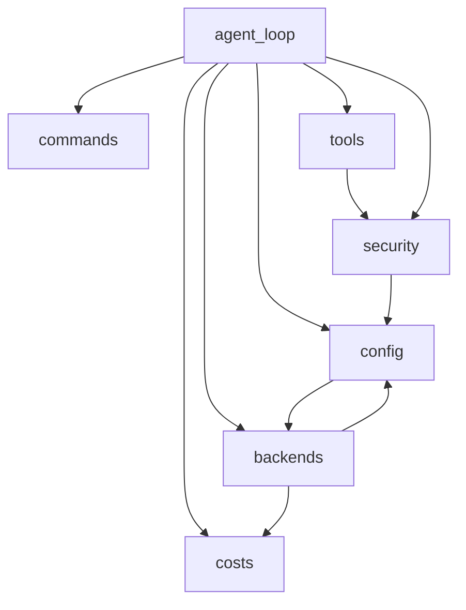

# UnifyWeaver Agent Loop - Generated Code

This code was generated by `agent_loop_module.pl` using a hybrid approach:
Prolog facts for tabular data (CLI arguments, slash commands, aliases, fallbacks)
and `py_fragment` atoms for imperative logic.

Regenerate with: `swipl -g "generate_all, halt" ../agent_loop_module.pl`

## Backends

- **coro**: Coro-code CLI backend using single-task mode
- **claude_code**: Claude Code CLI backend using print mode
- **gemini**: Gemini CLI backend
- **claude_api**: Anthropic Claude API backend
- **openai_api**: OpenAI API backend
- **ollama_api**: Ollama REST API backend for local models
- **ollama_cli**: Ollama CLI backend using 'ollama run' command
- **openrouter_api**: OpenRouter API backend with model routing

## Tools

- **bash**: Execute a bash command
- **read**: Read a file
- **write**: Write content to a file
- **edit**: Edit a file with search/replace

## Module Dependencies



## Usage

```bash
python3 agent_loop.py              # interactive
python3 agent_loop.py "prompt"     # single prompt
python3 agent_loop.py -b claude    # use Claude API
```
